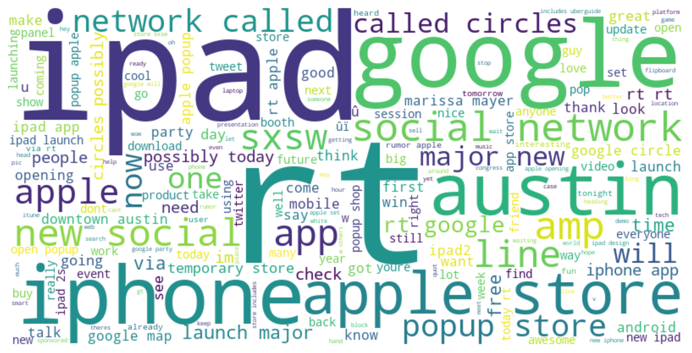
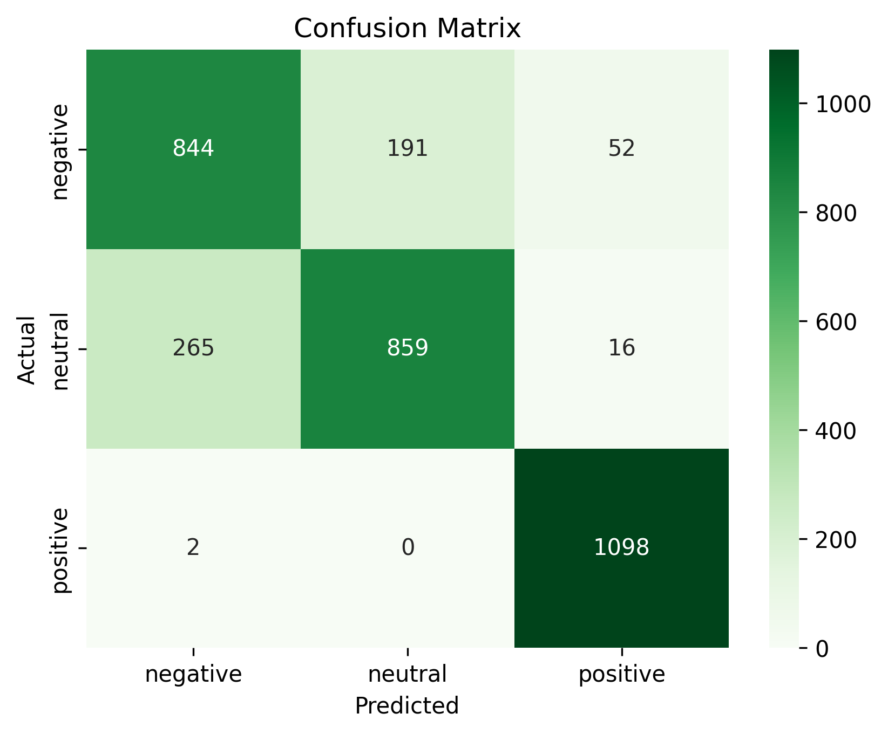
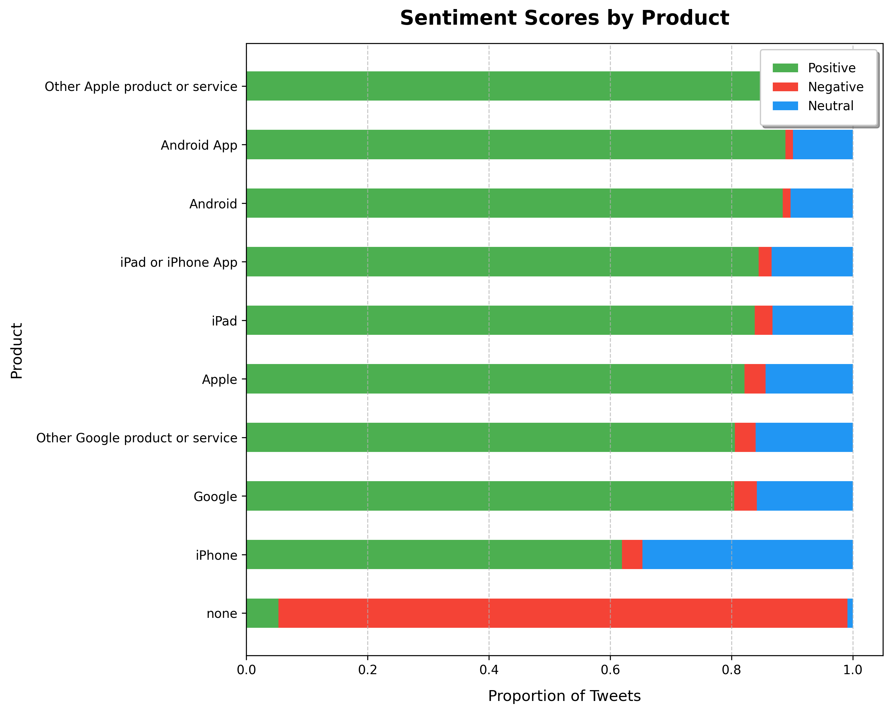

# **NLP Twitter Sentiment Analysis on Apple and Google Products**

- **Author**: Noah Meakins
- **Phase**: Phase 4


---

## **Overview**

This project builds an NLP model to analyze sentiment (negative, neutral, or positive) in tweets about Apple and Google products, providing actionable insights for a hypothetical consumer insights startup.

**Stakeholder:**

- **Consumer Insights Startup:**

  - This startup specializes in analyzing social media sentiment and providing actionable insights to clients in the tech industry, including Apple and Google.
  - Clients: Companies, investors, or analysts looking to understand brand performance and market trends for Apple and Google products.

---

## **Data**

- **Source**: CrowdFlower via [data.world](https://data.world/crowdflower/brands-and-product-emotions).
- **Size**: 9,093 tweets, labeled by sentiment (negative, neutral, positive).

---

## **Methods**

1. **Preprocessing**:
   - Cleaned and standardized data.
   - Handled missing values and addressed class imbalance with `RandomOverSampler`.
2. **EDA**:
   - Analyzed sentiment and product distribution, visualized via word cloud and bar charts.
3. **Modeling**:
   - Progressed from logistic regression to deep learning models (embedding, CNN, LSTM).
   - Final Model: **Fourth Run (Refined Deep Learning Model)** with 84% accuracy and balanced performance across all sentiment classes.
4. **Evaluation**:
   - Used accuracy, F1-scores, and ROC AUC to assess performance.
   - Visualized results with confusion matrices and ROC AUC heatmaps.

---

## **Results**

- **Final Model Performance**:
  - **Accuracy**: 84.00%
  - **F1-Score (Macro Average)**: 84.00%
  - **ROC AUC**: 0.9388
- Positive sentiment classification achieved near-perfect precision and recall.

---

## **Visualizations**

1. **Word Cloud**:
   
2. **Confusion Matrix (Final Model)**:
   
3. **Sentiment Distribution**:
   

---

## **Conclusion**

The final model provides a robust tool for sentiment analysis, offering insights into customer opinions of Apple and Google products. These findings can guide marketing, customer experience, and product strategy. Future enhancements include using pre-trained embeddings like GloVe or BERT and testing on unseen datasets.

**Actionable Business Recommendations**

1. **Targeted Marketing Campaigns**:
   - **Insight**: The analysis revealed that products like iPad and other Apple services consistently receive high positive sentiment, while certain categories (e.g., tweets with no specific product mention) are more negative.
   - **Action**: Focus marketing efforts on products with high positive sentiment to amplify their success. For categories with higher negative sentiment, implement reputation management strategies and targeted campaigns to address customer concerns.

2. **Real-Time Sentiment Monitoring**:
   - **Insight**: This model can be deployed to monitor real-time sentiment on social media.
   - **Action**: Integrate the model into a live dashboard for continuous sentiment tracking. Use this tool to identify spikes in negative sentiment and take corrective actions.

3. **Product and Service Improvement**:
   - **Insight**: Neutral sentiment accounts for the majority of tweets, suggesting opportunities to engage customers who feel indifferent about specific products.
   - **Action**: Conduct further analysis on neutral sentiment tweets to identify patterns and areas of improvement. Use the findings to enhance product features, user experiences, and customer satisfaction.

---

## **For More Information**

Explore the full analysis in:

- [Notebook](notebook.ipynb)
- [Presentation PDF](presentation.pdf)

For questions, contact Noah Meakins | <unknownerror66@outlook.com>

---

## Repository Structure

```
├── data                                 <- Folder containing dataset used for analysis
│   ├── raw                              <- Folder containing raw dataset
│   ├──├─Brands and Product Emotions.csv <- Raw dataset from source
├── images                               <- Folder containing any images sourced or generated in the analysis
│   ├── sourced-images                   <- Images sourced from the internet for borders in README and notebook.ipynb
├── PDF                                  <- PDF folder for any PDF files used
│   ├── nlp-presentation.pdf             <- PDF version of project presentation
├── .gitignore                           <- File for ignoring large or unwanted files in git
├── notebook.ipynb                       <- Jupiter Notebook where analysis was completed
├── README.md                            <- The top-level README for reviewers of this project
```
