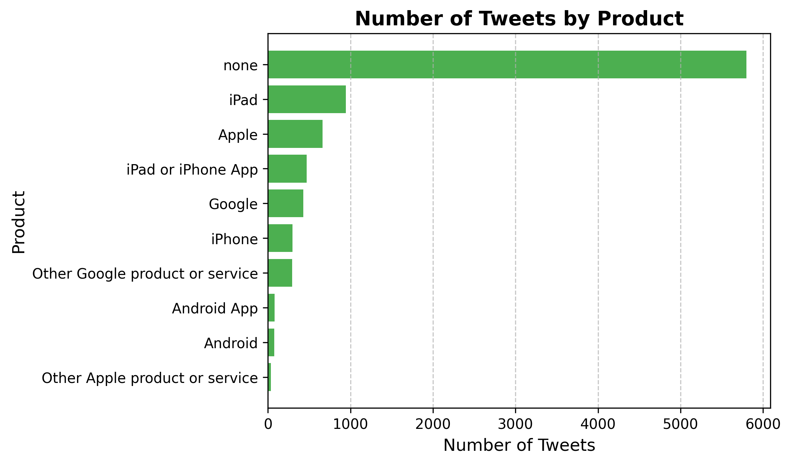
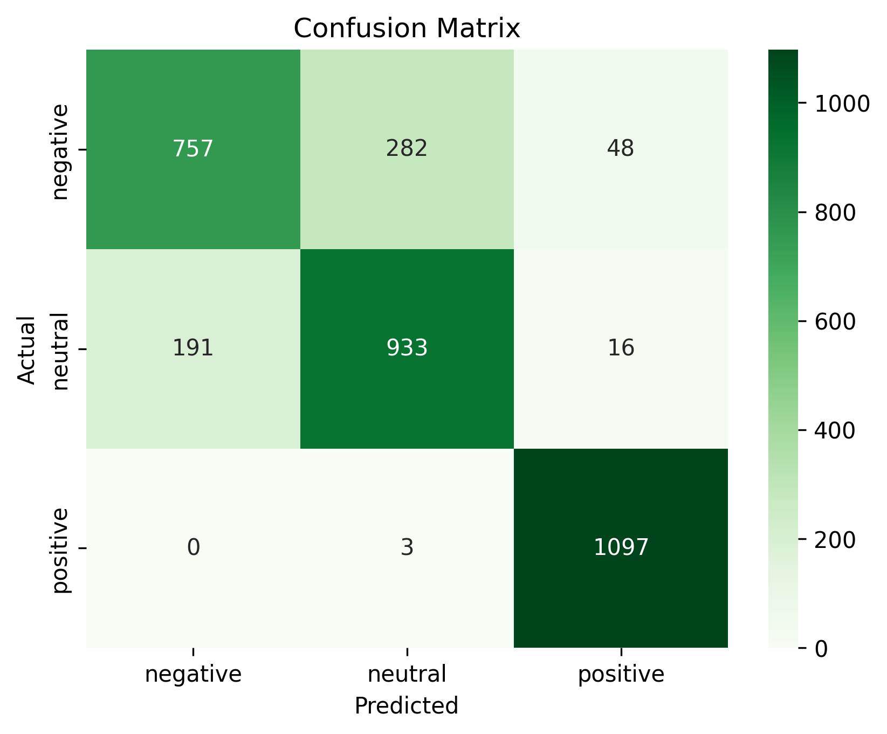

# **Natural Language Processing Twitter Sentiment Analysis on Apple and Google Products**

**Author: Noah Meakins**
**Phase: Phase 4**


---

## **Overview**

The main objective of this project is to build an NLP model to analyze Twitter sentiment about Apple and Google products.

---

## **Business Understanding:**

**Stakeholder:**

- **Consumer Insights Startup:**

  - This startup specializes in analyzing social media sentiment and providing actionable insights to clients in the tech industry, including Apple and Google.
  - Clients: Companies, investors, or analysts looking to understand brand performance and market trends for Apple and Google products.

---

## **Data Understanding**

The dataset used in this project was sourced from CrowdFlower via [data.world]([https://](https://data.world/crowdflower/brands-and-product-emotions)). In its raw form, it contains 3 columns and 9,093 rows of supervised data. The sentiment of each tweet was rated by a human.

---

## **Methods**

The goal of this project was to build a robust NLP model to classify Twitter sentiment (negative, neutral, or positive) about Apple and Google products. Below is an outline of the methods and techniques used to achieve this:

**1. Data Preprocessing**

- **Dataset**: Sourced from CrowdFlower via data.world, containing 9,093 tweets with human-labeled sentiment.
- **Steps Taken**:
  - Renamed and standardized column names for clarity.
  - Identified and handled missing values:
    - Replaced missing product labels with `"none"`.
    - Dropped rows with missing tweets, as empty text is non-informative for NLP.
  - Explored unique values in product and sentiment columns to confirm data quality.

**2. Exploratory Data Analysis (EDA)**

- Analyzed the distribution of tweets by sentiment and product to understand class imbalance.
- Visualized word frequencies with a word cloud to highlight the most discussed products and topics.
- Examined the proportion of positive, neutral, and negative tweets for each product category.

**3. Modeling**

A progressive modeling approach was used to refine the performance and address project requirements:

**Baseline Model**

- **Pipeline**: Logistic Regression with CountVectorizer for text vectorization.
- **Performance**: Served as a reference point with moderate accuracy but significant overfitting.

**Advanced Deep Learning Models**

- **Third and Fourth Runs**: Built on lessons from earlier models with refined architectures:
  - **Text Preprocessing**: Tokenized tweets and padded sequences for uniform input lengths.
  - **Model Architecture**:
    - **Embedding Layer**: Learned 128-dimensional embeddings for semantic representation.
    - **Convolutional Layers**: Extracted local patterns in text sequences.
    - **LSTM Layers**: Modeled sequential dependencies for context understanding.
    - **Dropout Layers**: Applied for regularization to prevent overfitting.
  - **Optimization**: Used the Adam optimizer with categorical crossentropy loss.

**4. Resampling for Class Imbalance**

- Applied `RandomOverSampler` to balance sentiment classes, addressing the dataset's inherent imbalance.

**5. Model Evaluation**

- Metrics used:
  - **Accuracy**: To evaluate overall correctness.
  - **Precision, Recall, and F1-Score**: To assess performance for each sentiment class.
  - **ROC AUC Scores**: To measure the model's ability to distinguish between sentiment classes.
- Confusion matrices and ROC AUC heatmaps were visualized to identify strengths and areas for improvement.

**6. Final Model Selection**

- The **Fourth Run (Refined Deep Learning Model)** was chosen as the final model due to:
  - Superior performance (84% accuracy and high F1-scores across all classes).
  - Improved generalization with reduced overfitting.
  - Robust architecture combining embedding, convolutional, and LSTM layers.

**7. Recommendations**

- The final model can be deployed to monitor real-time sentiment on social media.
- Future improvements could include using pre-trained embeddings like GloVe or FastText and testing on unseen datasets to confirm generalization.

---

## **Results**

**Chosen Model: Fourth Run (Refined Deep Learning Model)**

The **Fourth Run: Refined Deep Learning Model** was selected as the final model due to its superior performance, generalization, and robustness across all sentiment classes. Below are the key reasons for this decision:

**1. Performance Metrics**

- **Accuracy**: Achieved an overall accuracy of **84.00%**, the highest among all models tested.
- **F1-Scores**:
  - **Macro Average**: 84.00%
  - **Weighted Average**: 84.00%
  - Consistently strong F1-scores across all classes indicate the model balances precision and recall effectively.
- **Class-Specific Strengths**:
  - **Positive Sentiment**: Near-perfect performance with an F1-score of **0.97**.
  - **Neutral and Negative Sentiments**: Significant improvement compared to previous runs, with better recall and reduced misclassifications.

**2. Generalization**

- The model demonstrates minimal overfitting:
  - **Training Accuracy**: 93.55%
  - **Validation Accuracy**: 84.31%
- This close alignment between training and validation performance indicates the model is well-regularized and can generalize effectively to unseen data.

**3. Advanced Architecture**

- **Embedding Layer**: Captures semantic relationships between words, enhancing text representation.
- **Convolutional Layers**: Extracts local features, such as phrases or keywords, that are critical for sentiment classification.
- **LSTM Layer**: Models sequential dependencies, improving the understanding of sentence structure and context.
- **Dropout Layers**: Reduces overfitting, ensuring the model learns meaningful patterns rather than noise.
- The combination of these components provides a robust framework for handling the complexities of NLP tasks.

**4. Strong ROC AUC Scores**

- **Overall ROC AUC**: 0.9388, indicating the model is highly effective at distinguishing between sentiment classes.
- **Class-Specific ROC AUC Scores**:
  - Negative: 0.90
  - Neutral: 0.92
  - Positive: 0.99
- These scores highlight the model's strong discriminatory power across all classes, with exceptional performance for the positive class.

**5. Iterative Refinement**

- The Fourth Run represents the culmination of iterative improvements:
  - Addressed class imbalance using `RandomOverSampler`.
  - Enhanced architecture with additional convolutional layers and regularization.
  - Focused on reducing misclassifications for the negative and neutral classes, achieving balanced results.

---

## **Visualizations**

**Word Cloud**


**Sentiment Distribution**


**Number of Tweets by Product**


**Confusion Matrix of Final Model**


---

## **Conclusion**

This project successfully built and evaluated a robust natural language processing (NLP) model to classify sentiment (negative, neutral, or positive) in tweets about Apple and Google products. By leveraging iterative improvements in data processing, model architecture, and evaluation, the project delivered actionable insights aligned with the business problem.

**Key Takeaways**

1. **Final Model Performance**:
   - The **Fourth Run (Refined Deep Learning Model)** achieved:
     - **Accuracy**: 84.00%
     - **Macro Avg F1-Score**: 84.00%
     - **Weighted Avg F1-Score**: 84.00%
   - This model demonstrated strong generalization and balanced performance across all sentiment classes.
   - The model excels at identifying positive sentiment (F1-score: 0.97), while also showing significant improvements for neutral and negative sentiments compared to earlier iterations.

2. **Business Implications**:
   - The insights generated by this model can help Apple and Google understand public sentiment about their products on social media.
   - Positive sentiment trends can guide marketing and product promotion strategies, while neutral and negative sentiment can highlight areas for improvement.
   - This predictive capability enables real-time monitoring of customer perceptions, improving both customer satisfaction and brand image.

3. **Iterative Refinement**:
   - Early models, such as the baseline logistic regression model, provided a foundation but suffered from overfitting and imbalanced performance.
   - Successive improvements, including addressing class imbalance, adding convolutional and LSTM layers, and using regularization techniques, led to the robust final model.

**Future Work**

1. **Enhancing Text Representation**:
   - Experiment with pre-trained embeddings like GloVe, FastText, or BERT to further improve the model's semantic understanding.
   - Incorporate domain-specific vocabulary if applicable to enhance classification accuracy.

2. **Expanding Model Applications**:
   - Deploy the model for real-time monitoring of tweets to capture evolving sentiment trends.
   - Extend the analysis to include topic modeling or keyword extraction to identify specific issues driving sentiment.

3. **Evaluation on Unseen Data**:
   - Test the model on external datasets or new data streams to validate its generalization capabilities.

**Closing Remarks**

This project demonstrates the power of machine learning and NLP in providing actionable insights for stakeholders. By understanding customer sentiment on social media, businesses like Apple and Google can make data-driven decisions to improve customer satisfaction, product development, and marketing strategies.

---

## **For More Information**

Please review my full analysis in [my jupiter notebook](notebook.ipynb) or [PDF presentation]().

---

## Repository Structure

```
├── data                                 <- Folder containing dataset used for analysis
│   ├── raw                              <- Folder containing raw dataset
│   ├──├─Brands and Product Emotions.csv <- Raw dataset from source
├── images                               <- Folder containing any images sourced or generated in the analysis
│   ├── sourced-images                   <- Images sourced from the internet for borders in README and notebook.ipynb
├── PDF                                  <- PDF folder for any PDF files used
│   ├── presentation.pdf                 <- PDF version of project presentation
├── .gitignore                           <- File for ignoring large or unwanted files in git
├── notebook.ipynb                       <- Jupiter Notebook where analysis was completed
├── README.md                            <- The top-level README for reviewers of this project
```
